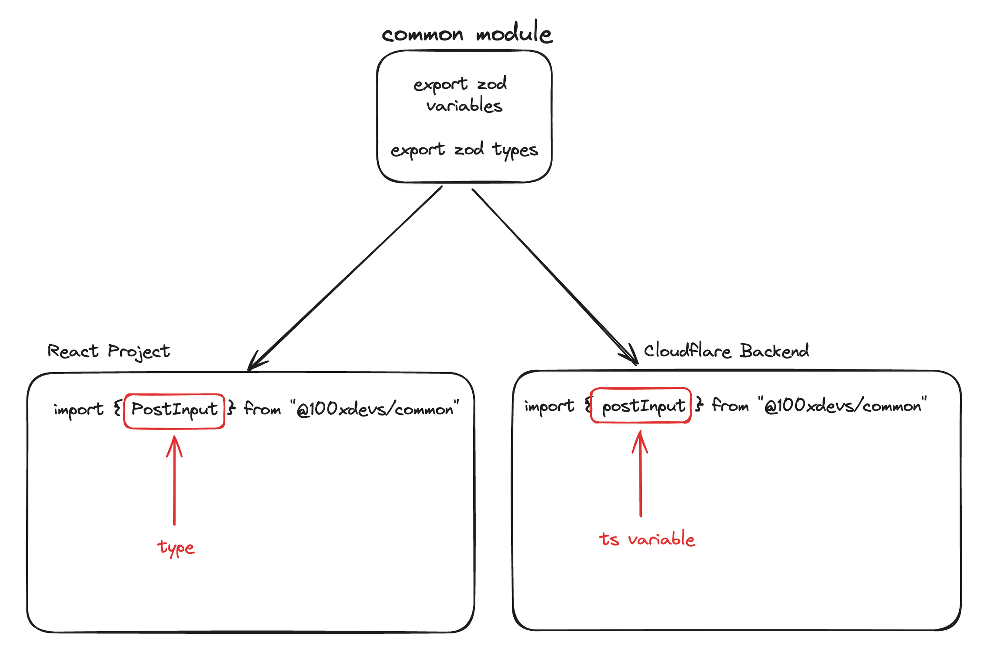

# Techstack:

- Frontend: React
- Backend : CLoudflare Workers
- Validation: Zod + Type-Inference
- Base Lang: Typescript
- Object R. Model: Prisma, with connection pooling
- Database: Postgres
- Auth: Jwt + cookies

# Backend

Backend will be ideally having 4+1 routes

Users: - POST: /api/v1/signup - POST: /api/v1/signin

Blog: - POST: /api/v1/blog - PUT: /api/v1/blog - GET: /api/v1/blog/:id - GET: /api/v1/blog/bulk

# Connection Pointers

- If you are using a Node.js based edge env, then the pooled connection will work with neon.db pool url
- However, if you are using a diff js runtime ( like AWS / cloudflare ) is when neon.tech pooled conn might work for you
- The pooled connection that you get from neon.db does not have a bunch of prisma dependencies that the prisma pooled connection does

# RUntime ZOd variables

- The common module will act as a resource for both frontend and backend.
- The backend with use the module to get zod variables, smilarly frontend will use it to get zod types

